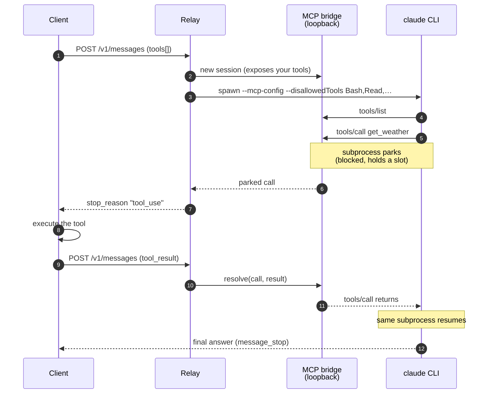

# HTTP API

This page is the prose. The same contract is published machine-readably as
[`openapi.json`](openapi.md) — scoped to what the relay *adds* (headers, status
codes, retained outputs), since the model APIs themselves are specified
upstream.

## Authentication

Every endpoint except `GET /health` — and, when A2A is enabled, the public
Agent Card — requires a configured token, supplied as either header:

```
Authorization: Bearer <token>
x-api-key: <token>
```

Tokens are compared in constant time. Unauthenticated requests are rejected
with 401 **before** any backend subprocess is spawned. When no tokens are
configured (only permitted on loopback binds), all callers pass.

## `POST /v1/messages` — Anthropic Messages

Request body (v1 supports text content only):

```json
{
  "model": "sonnet",
  "max_tokens": 1024,
  "system": "optional system prompt (string or text blocks)",
  "stream": true,
  "messages": [
    {"role": "user", "content": "hello"}
  ]
}
```

- `content` may be a string or an array of content blocks. Supported block
  types: `text`, `tool_use` (assistant turns), `tool_result` (user turns),
  and base64 `image`/`document` blocks (see "Attachments" below).
  `thinking` blocks echoed back by clients are dropped silently; unknown
  block types are rejected with 400.
- Roles are limited to `user` and `assistant`.
- `max_tokens` is accepted for wire compatibility (the Anthropic format makes
  it mandatory) but **not enforced** by the claude backend — the CLI has no
  flag to cap output tokens, so responses may exceed it. The relay logs a
  one-time warning when a request carries `max_tokens` on a backend that
  cannot enforce it.
- `tools` and `tool_choice` are decoded, but serving them requires a backend
  that supports client-defined tools — see "Client-defined tools" below.
- `temperature`, `top_p`, `top_k`, and `stop_sequences` are decoded but
  **ignored** by the claude backend (the CLI has no such flags). The relay
  logs a one-time warning naming the parameters it dropped, rather than
  ignoring them silently.

**Streaming** (`"stream": true`) returns `text/event-stream` with the
standard Anthropic event sequence, flushed per event: `message_start`,
`content_block_start`, `content_block_delta` (text deltas),
`content_block_stop`, `message_delta` (stop reason + usage), `message_stop`.
Backend failures mid-stream are delivered as an `error` event.

**Non-streaming** returns a single `message` object with text content blocks
and token usage. When a backend emits tool calls, responses carry `tool_use`
blocks (`content_block_start` + `input_json_delta` when streaming) and
`stop_reason: "tool_use"`.

### Attachments (images and PDFs)

Standard base64 `image` and `document` blocks are accepted — the same shape
Anthropic SDK clients already send:

```json
{"type": "image", "source": {"type": "base64", "media_type": "image/png", "data": "<base64>"}}
{"type": "document", "source": {"type": "base64", "media_type": "application/pdf", "data": "<base64>"}}
```

Accepted media types: `image/png`, `image/jpeg`, `image/gif`, `image/webp`,
`application/pdf`; 20 MiB decoded per block; only `base64` sources (no URL
fetching). On the claude backend this works as a **bridge**: the relay
decodes each attachment into a per-request ephemeral directory, runs the CLI
with that directory as its working directory, and replaces the block with a
text reference that the CLI's read-only Read tool follows to view the file.
The directory is deleted when the request ends.

Two consequences of the bridge design: viewing is *model-mediated* (the model
follows the reference; in practice it does, but it is not the structural
guarantee of native API vision), and a request carrying attachments runs in a
clean ephemeral directory — it does not see the relay's own working
directory.

### Client-defined tools

Send `tools[]` and the relay runs the **standard Messages API tool loop**:
the model calls your tool, the response stops with `stop_reason: "tool_use"`
and a `tool_use` block, you execute the tool and send back a `tool_result` —
exactly as against the real API. The official SDKs work unmodified:

```python
from anthropic import Anthropic
client = Anthropic(base_url="http://127.0.0.1:18082", api_key=TOKEN)

resp = client.messages.create(model="haiku", max_tokens=300, tools=TOOLS, messages=msgs)
while resp.stop_reason == "tool_use":
    tu = next(b for b in resp.content if b.type == "tool_use")
    result = my_tool(**tu.input)                     # your code runs the tool
    msgs += [{"role": "assistant", "content": resp.content},
             {"role": "user", "content": [{"type": "tool_result",
                                           "tool_use_id": tu.id, "content": result}]}]
    resp = client.messages.create(model="haiku", max_tokens=300, tools=TOOLS, messages=msgs)
```

The parking mechanism, end to end — one CLI subprocess spans the whole loop,
blocked on the caller between turns:



**How it works.** The claude CLI has no raw tool-calling mode — but it speaks
MCP. So the relay hosts a small MCP server exposing *your* tools and points
the CLI at it (`--mcp-config`, with `--allowedTools` restricted to those tool
names). Crucially, it also turns off the CLI's **built-in** tools, denying them
by name (`--disallowedTools Bash,Read,Write,…`): otherwise the model has both
your tools and its own native `Write`/`Read`/`Bash`, and it prefers the native
ones — so your tools would never fire (the model just narrates), and any
granted permission would run the native tools on the *relay host* instead of
routing back to you. With the built-ins denied, every tool call goes through
your tools, which is the raw-model contract an agent client expects.

!!! warning "Why not `--tools ""`?"

    The CLI hands the model its MCP tools only while at least one **built-in**
    tool survives. Silence them all — `--tools ""`, `--disallowedTools "*"`, or
    a deny list sparing none — and the bridge's `mcp__relay__*` tools are
    dropped along with them. The model is then left with no tools at all: it
    narrates the tool call as prose, no `tool_use` ever reaches you, and your
    agent waits for a turn that never ends. The relay therefore leaves exactly
    one inert built-in registered (`ReportFindings`, which touches neither the
    host nor the network). Observed on claude 2.1.207.

When the model calls one, the MCP handler **parks**: the relay answers your
HTTP request with the `tool_use` block while the subprocess stays alive and
blocked. Your next request carries the `tool_result`, which resolves the parked
call and the same subprocess resumes — one CLI run serves the whole loop,
preserving its context.

Consequences worth knowing:

- **A parked conversation holds a concurrency slot** (the subprocess is
  alive). It is torn down after `RELAY_REQUEST_TIMEOUT` if you never return a
  result, so an abandoned loop cannot leak a process.
- The CLI is given **only your tools** and none of its own, so a tool request
  has no host side effects — every action is one your code executes, on your
  machine. This is what lets an agent client (OpenCode, LangChain, …) drive the
  relay: it supplies its toolset and the model works within it, exactly as
  against the raw API.
- The MCP endpoint listens on its **own loopback socket**, never on the
  relay's public bind, and each session carries an unguessable id plus a
  bearer token.
- `tool_choice` is decoded but not enforced (the CLI has no equivalent).

For what the API still offers that the relay cannot, see
[API vs relay limitations](limitations.md).

## `POST /v1/chat/completions` — OpenAI Chat Completions

```json
{
  "model": "sonnet",
  "stream": false,
  "messages": [
    {"role": "system", "content": "optional"},
    {"role": "user", "content": "hello"}
  ]
}
```

`system` / `developer` messages map onto the backend system prompt.
`max_tokens` and `max_completion_tokens` (the modern OpenAI parameter, which
takes precedence) are optional here and carry the same limitation as on
`/v1/messages`: accepted, but not enforced by the claude backend. Sampling
parameters (`temperature`, `top_p`, `stop`) are likewise decoded but ignored,
with a one-time warning.

Streaming returns `chat.completion.chunk` SSE frames terminated by
`data: [DONE]`. With `stream_options: {"include_usage": true}`, a final chunk
with an empty `choices` array carries `usage` just before `[DONE]`, as the
OpenAI API does. Non-streaming returns a `chat.completion` object with
`usage`.

**Client-defined tools work here too.** `tools[]` is served by the same [MCP
bridge](#client-defined-tools) as on the Anthropic wire: the model's call comes
back as `message.tool_calls[]` with `finish_reason: "tool_calls"`, and you
return the result as a `{"role": "tool", "tool_call_id": …}` message — the
standard OpenAI tool loop. (Until v0.9.0 this wire accepted `tools[]` and then
silently dropped them, so the model never saw them.)

## Using the relay from an agent client

Agent CLIs and frameworks that speak either wire can point at the relay. For
[OpenCode](https://opencode.ai), declare it as a custom provider in
`opencode.json` — use the **Anthropic** wire, which is where the tool loop is
best exercised:

```json
{
  "$schema": "https://opencode.ai/config.json",
  "provider": {
    "agent-relay": {
      "npm": "@ai-sdk/anthropic",
      "name": "agent-relay",
      "options": {
        "baseURL": "http://127.0.0.1:18082/v1",
        "apiKey": "{env:RELAY_TOKEN}"
      },
      "models": {
        "sonnet": { "name": "Sonnet (relay)", "limit": { "context": 200000, "output": 64000 } },
        "haiku":  { "name": "Haiku (relay)",  "limit": { "context": 200000, "output": 64000 } }
      }
    }
  }
}
```

Then `RELAY_TOKEN=… opencode run --model agent-relay/haiku "…"`. The agent's own
tools (read, edit, bash…) are executed by the *client*, on your machine, through
the relay's tool loop — the relay stays in inference mode and touches nothing.

## Agentic requests

When the relay runs with `RELAY_AGENTIC_ENABLED=true` and
`RELAY_AGENTIC_PER_REQUEST_AUTHZ=true`, agentic execution is granted **per
request**: in addition to the normal caller credential, the request must
carry a valid agentic credential from `RELAY_AGENTIC_TOKENS`:

```
X-Agentic-Authorization: Bearer <agentic-token>
```

- Without the header, the request is served in plain inference mode (no
  permission flags, no side effects).
- With an invalid credential — including a caller token, the two sets are
  never interchangeable — the request is rejected with **403** before any
  subprocess is spawned.
- If the header is sent to a relay whose agentic mode is disabled, the
  response is also 403.

Authorized agentic requests run with the operator-configured permission
flags, each in its own ephemeral working directory. See
[execution-modes.md](execution-modes.md) for the full inference-vs-agentic
comparison.

### Per-request timeout

A long agentic task and a short classification should not share one global
deadline. Send `X-Request-Timeout` (a Go duration: `90s`, `5m`) to set this
request's deadline:

```sh
curl http://127.0.0.1:18082/v1/messages -H "x-api-key: $TOKEN" \
  -H "X-Request-Timeout: 30s" -d '{…}'
```

`RELAY_REQUEST_TIMEOUT` is both the default **and the ceiling**: a longer
request is clamped rather than refused, and the response echoes the value
actually applied in `X-Request-Timeout`. A malformed duration is a 400.

When the deadline expires the relay answers **504 Gateway Timeout** (not
502), so a client can tell "my deadline hit" from "the backend broke". The
subprocess is killed with its process group; nothing is left running.

### Session continuity (resuming a conversation)

Every response carries the backend's conversation id:

```
X-Relay-Session-Id: 133cc414-ce5e-4b5a-80ca-3997e1ce9641
```

Send it back on a later request to **resume** that conversation: the backend
keeps its context (and its prompt cache) instead of starting fresh, and the
relay does not have to replay the history as a flattened transcript.

```sh
# turn 1 — note the X-Relay-Session-Id in the response headers
curl -D- http://127.0.0.1:18082/v1/messages -H "x-api-key: $TOKEN" \
  -d '{"model":"haiku","max_tokens":100,"messages":[{"role":"user","content":"Remember: ANANAS."}]}'

# turn 2 — resume
curl http://127.0.0.1:18082/v1/messages -H "x-api-key: $TOKEN" \
  -H "X-Relay-Session-Id: 133cc414-…" \
  -d '{"model":"haiku","max_tokens":100,"messages":[{"role":"user","content":"Which word?"}]}'
# → "ANANAS"
```

**The workspace must be stable.** The claude CLI keys its sessions by working
directory, so resuming only works where that directory persists:

| Mode | Resumable? |
|---|---|
| Inference | ✅ — the workdir is the static `RELAY_CLAUDE_WORKDIR` |
| Agentic with a retained workspace | ✅ — pin it by echoing the previous `X-Agentic-Outputs` id back on the request |
| Agentic with an ephemeral workspace | ❌ — 400, with an explanation |

Pinning a workspace *and* resuming a session is the combination that gives a
**persistent agentic workspace**: the agent keeps both its files and its
memory across requests.

```sh
# turn 2, agentic: same files, same conversation
curl http://127.0.0.1:18082/v1/messages -H "x-api-key: $TOKEN" \
  -H "X-Agentic-Authorization: Bearer $AGENTIC" \
  -H "X-Agentic-Outputs: 668e8c35…" \
  -H "X-Relay-Session-Id: 32e9fa00-…" \
  -d '{"model":"haiku","max_tokens":100,"messages":[{"role":"user","content":"What file did you create?"}]}'
```

Session ids are validated as UUIDs before reaching the CLI (a caller-supplied
argv element must not be able to become a flag). Note that only the *new*
message needs to be sent on a resumed turn — the backend already holds the
history.

### Agent tool traces

An agentic run is otherwise a black box: the client sees text, never what the
agent *did*. Two ways to observe it:

**Live, on the stream** — send `X-Agent-Traces: true` on a streaming
`/v1/messages` request. The relay then emits two extra SSE event types
alongside the standard ones:

```
event: agent_tool_use
data: {"type":"agent_tool_use","id":"toolu_…","name":"Write","input":{…}}

event: agent_tool_result
data: {"type":"agent_tool_result","tool_use_id":"toolu_…","content":"File created…","is_error":false}
```

Traces are **opt-in** because unknown SSE event types can trip strict SDK
stream parsers; without the header the stream is byte-for-byte the standard
one. They carry no content-block indices, so they never disturb the normal
`content_block_*` sequence. Tool results are truncated to 4 KiB.

**Durably, as a file** — any request whose outputs are retained
(`X-Agentic-Keep-Outputs`) also gets a `trace.jsonl` in its output directory,
one JSON object per tool call and result, retrievable through the endpoints
below. No header needed, and no file is created if the agent used no tools.

Traces are available on `/v1/messages`; the OpenAI wire has no event-name
channel, so use the `trace.jsonl` route there.

### Retrieving agentic outputs

By default an agentic request's working directory is deleted when the
request ends. Send `X-Agentic-Keep-Outputs: true` on an agentic-authorized
request to retain it: the response carries an unguessable id in the
`X-Agentic-Outputs` header, usable with:

| Method + path | Effect |
|---|---|
| `GET /v1/outputs/{id}` | JSON listing (`{"id", "files":[{"path","size"}]}`) |
| `GET /v1/outputs/{id}/files/{path}` | Download one artifact (octet-stream) |
| `DELETE /v1/outputs/{id}` | Release immediately (204) |

All three require the normal caller credential. Retained outputs are swept
after `RELAY_OUTPUTS_TTL` (default 10m); the header on a non-agentic request
is a 400. Path traversal in `{path}` is refused.

## `GET /health`

Unauthenticated liveness probe: `{"status":"ok"}`.

## `GET /v1/metrics`

Authenticated, minimal JSON counters:

```json
{
  "uptime_seconds": 120,
  "requests_total": 42,
  "in_flight": 1,
  "rejected_busy": 0,
  "unauthorized": 3,
  "agentic_denied": 0,
  "backend_errors": 0,
  "input_tokens_total": 1280,
  "output_tokens_total": 9450,
  "cost_usd_total": 0.284
}
```

`cost_usd_total` is the sum of the dollar costs the backend reports per turn
(the claude CLI reports one). Each served request also logs a `request usage`
line carrying its `input_tokens`, `output_tokens`, and `cost_usd`, correlated
by `X-Request-Id` — enough for a fanning-out client to attribute spend
per request.

## Errors

| Status | Meaning |
|---|---|
| 400 | Malformed body, unsupported role or content block type, or an unsatisfiable header combination (e.g. resuming without a stable workspace). |
| 401 | Missing or invalid credential. |
| 403 | Agentic execution denied (disabled, or an invalid agentic credential). |
| 404 | Unknown or expired outputs id. |
| 429 | Per-caller rate limit exceeded. Carries `Retry-After`. No subprocess was spawned. |
| 502 | Backend failed before producing a stream. |
| 503 | All concurrency slots busy. Carries `Retry-After`. No subprocess was spawned. |
| 504 | The request deadline expired (`X-Request-Timeout`, or `RELAY_REQUEST_TIMEOUT`). |

Both 429 and 503 carry a `Retry-After` header (seconds), so a client fanning
requests out can pace itself instead of hammering. The quota is off by
default; set `RELAY_RATE_LIMIT_RPM` to bound sustained requests per minute
per caller (the concurrency cap bounds *simultaneous* work; the quota bounds
*spend*).

Error bodies follow the wire format of the endpoint (Anthropic
`{"type":"error","error":{...}}` shape on `/v1/messages`, OpenAI
`{"error":{...}}` shape on `/v1/chat/completions`).

Every response carries an `X-Request-Id` header for log correlation.
