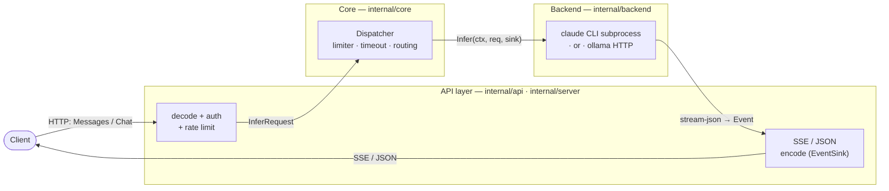
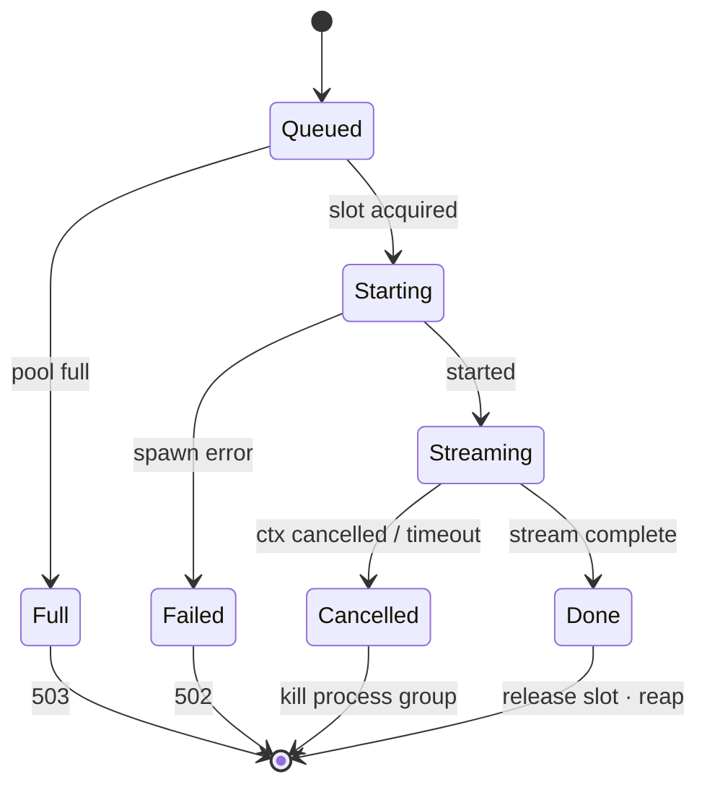
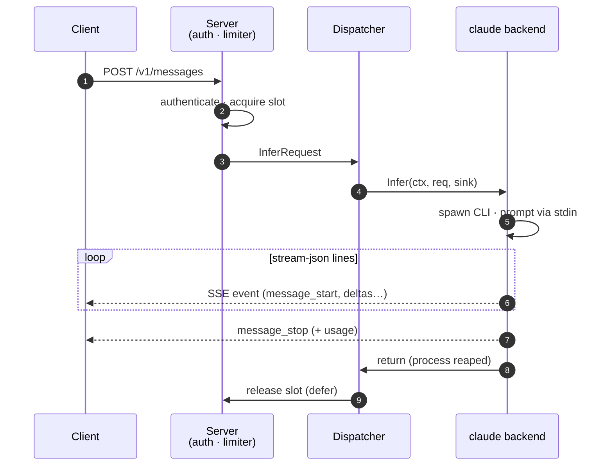

# Architecture

The relay is a three-layer pipeline with a neutral model in the middle, so
the wire format and the backend never touch each other directly.



- **API layer** (`internal/api/*`, `internal/server`) — HTTP handlers plus
  wire encoders/decoders. Translates Anthropic Messages and OpenAI Chat
  Completions ⇄ the neutral `InferRequest`/`Event` model.
- **Core** (`internal/core`) — auth-independent dispatch: concurrency
  limiter, per-request timeout, handoff to the selected backend. Knows
  nothing about any specific CLI or wire format.
- **Backend** (`internal/backend/*`) — one adapter per agent CLI. Spawns and
  supervises the subprocess and parses its output into neutral `Event`s. The
  only layer that knows `claude`.

## Package layout

```
cmd/relay/main.go               # env parse, Validate, wire up, ListenAndServe
internal/config/                # Config, loading, Validate (startup guards)
internal/core/                  # Message, InferRequest, Event, Backend, registry, Limiter, Dispatcher
internal/server/                # http mux, middleware (auth, request-id), handlers
internal/api/anthropic/         # Messages wire <-> core (decode, SSE + collect sinks)
internal/api/openai/            # Chat Completions wire <-> core
internal/backend/claude/        # Claude adapter (spawn, stream-json parse, env sanitize)
internal/obs/                   # request-id, structured logging, metrics
```

Dependency direction is strictly inward: `api`, `server`, and `backend`
depend on `core`; `core` depends on nothing in the module. `core` is
unit-testable in isolation.

## The neutral model

`core.InferRequest` is the normalized request (logical model name, system
prompt, text-only messages, stream flag). Backends emit a flat stream of
`core.Event` values (`MessageStart`, `TextDelta`, `Usage`, `MessageStop`,
`Error`) into a `core.EventSink`, which each wire format implements once.

This seam is what makes new backends additive: a Gemini or Codex adapter is
one new package under `internal/backend/` that calls `core.Register` from an
`init()` — zero changes to the API or core layers.

## Request lifecycle



- Slot acquisition is **non-blocking**: a full pool yields 503 immediately,
  before any subprocess is spawned.
- Slot release is `defer`-guaranteed on every exit path.
- The request timeout is a `context.WithTimeout` wrapping the HTTP request
  context; cancellation (client disconnect or timeout) kills the whole
  subprocess process group, and `Infer` does not return until the process is
  reaped. An expired deadline answers 504, not 502, so a client can tell a
  timeout from a backend failure.

The happy path, as a sequence:



## Claude backend specifics

- The prompt is piped via **stdin** (never argv — avoids `ARG_MAX` and
  process-list leaks).
- The subprocess environment is `os.Environ()` minus a deny list:
  `ANTHROPIC_BASE_URL` / `OPENAI_BASE_URL` (would loop the CLI back through
  the relay), `CLAUDECODE`, `ANTHROPIC_API_KEY` / `ANTHROPIC_AUTH_TOKEN` (so
  an inherited key cannot override the subscription), and any
  operator-configured keys (`RELAY_ENV_DENY`).
- `stream-json` output is parsed **defensively**: unknown line types and
  unknown fields are ignored, so CLI schema drift degrades gracefully.
- No permission-bypass flags are ever passed on the default inference path;
  agentic flags are an explicit operator opt-in, and with per-request authz
  enabled they apply only to requests that presented a valid agentic
  credential (`InferRequest.Agentic`, set by the server, re-checked by the
  backend).
- In agentic mode, every request runs in its own **ephemeral working
  directory** (created under `RELAY_CLAUDE_WORKDIR`, or the system temp dir),
  removed once the subprocess is reaped — concurrent requests never see each
  other's files, and no state persists between requests.

The full comparison of the two execution modes — enforcement mechanisms,
guarantees, and caveats — is in [execution-modes.md](execution-modes.md).
