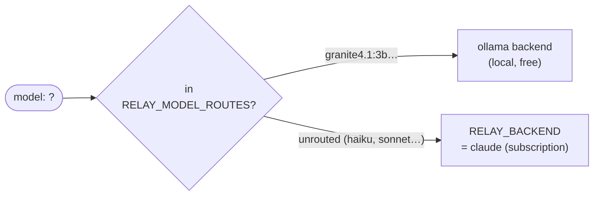

# Backends and model routing

The relay ships two backends. They are deliberately different *kinds* of
adapter — one supervises a subprocess, the other is an HTTP client — which is
what proves the neutral model in the middle is doing its job: adding a
backend touched neither the wire adapters nor the core.

| | `claude` | `ollama` |
|---|---|---|
| What it is | the `claude` CLI, one supervised subprocess per request | a local [Ollama](https://ollama.com) server over HTTP |
| Cost | your Anthropic subscription | free (runs on your machine) |
| Streaming | ✅ | ✅ |
| Client-defined tools | ✅ via the [MCP bridge](api.md#client-defined-tools) | ✅ natively — **but only on some models**, see below |
| `max_tokens` | ❌ not enforced (no CLI flag) | ✅ enforced (`num_predict`) |
| `temperature` / `top_p` / `top_k` / stop | ❌ dropped (signaled) | ✅ honored |
| Images / PDFs | ✅ via the [attachment bridge](api.md#attachments-images-and-pdfs) | ✅ natively (base64 images) |
| Agentic execution | ✅ opt-in | ❌ — Ollama only generates |
| Reported cost | `total_cost_usd` from the CLI | 0 (local inference) |

Capabilities are resolved **per request**, from the backend that will
actually serve it: ask `haiku` for `max_tokens` and you get the
not-enforced warning; ask a local model and it is enforced.

## Ollama and client tools: the `tools` badge is not enough

This matters the moment you point an **agent client** (OpenCode, LangChain…) at
a local model: an agent sends its toolset on *every* request, even a plain
"hello". So a model without tool calling fails outright — Ollama answers
*"`llama3` does not support tools"* and nothing works, tools or not.

Worse, Ollama's `tools` capability badge is **necessary but not sufficient**.
A model can carry it and still write the call as *text* (a markdown JSON block)
instead of emitting a structured `tool_call` that Ollama parses — in which case
the client never runs it, and the turn just ends. Whether it works depends on
the model *and* its Ollama template, and the only way to know is to try.

Measured on an Apple M4 / 16 GB, with an OpenCode-sized request (~5k characters
of system prompt, four tools):

| model | time | real `tool_use`? |
|---|---|---|
| `granite4.1:3b` | ~3 s | ✅ |
| `llama3.1:8b` | ~10 s | ✅ |
| `qwen3.5` (9.7B, *thinking*) | 13–45 s | ✅ but slow |
| `qwen2.5-coder` (3b, 7b) | 3–5 s | ❌ **writes the call as text** |
| `phi3`, `llama3`, `dolphin-mixtral` | — | ❌ no tool support at all |

Check a model before relying on it:

```sh
ollama show <model> | grep -i tools      # necessary
# then actually send it a tool and see whether a tool_call comes back
```

!!! note "Thinking models"

    The backend sends `think: false`. A thinking model (qwen3.x) otherwise puts
    its reasoning in Ollama's `thinking` field and the answer in `content` only
    once it is done — and since the backend surfaces `content` alone, the caller
    would get an empty answer, or a silent gap long enough for an agent client to
    cancel. See the [roadmap](https://github.com/s-celles/agent-relay/blob/main/ROADMAP.md)
    for surfacing it properly instead.

## Routing by model name

The client keeps doing what it does against the real API — naming a model.
The relay decides which backend that means:



```sh
RELAY_BACKEND=claude \
RELAY_MODEL_ROUTES="granite4.1:3b=ollama,llama3.1:8b=ollama" \
./relay
```

```sh
# same endpoint, same client, same credential — different engine
curl … -d '{"model":"haiku",  …}'   # → claude CLI, your subscription
curl … -d '{"model":"granite4.1:3b", …}'  # → local Ollama, free
```

Anything without a route goes to `RELAY_BACKEND`. A route naming a backend
that does not exist refuses to start (fail fast) rather than silently falling
back.

This is the DQ-2 answer: routing by model name keeps clients backend-agnostic
— no per-provider URL prefix, no custom header — exactly as the real API
behaves, and as other relays (LiteLLM, OpenRouter) do it.

## Why route at all?

- **Spend where it matters.** Send classification, extraction, or draft work
  to a local model for nothing, and keep the subscription for what needs it.
  The cost accounting shows it plainly: a `haiku` request logs
  `cost_usd=0.0237`, a local one logs `cost_usd=0`.
- **Get the API features the CLI lacks.** Sampling control and enforced
  `max_tokens` work on the Ollama backend — route a model there when a
  workload actually needs them.
- **Keep working offline.** A local model answers with no network at all.

## What this is not: a provider router

Routing exists here to **compose the sources you already own** — a
subscription reachable only through its CLI, and local compute you run
yourself. It is not there to aggregate HTTP providers.

If a service has an API and you hold a key for it (Mistral, Groq, OpenRouter,
Together…), a backend here would add nothing: call the API directly, or put a
real router in front. The relay already speaks `/v1/chat/completions`, so
**LiteLLM (or any OpenAI-compatible router) can register agent-relay as one of
its providers** — each tool doing its job:

```
your clients ──▶ LiteLLM (routing, retries, budgets, many providers)
                    ├──▶ agent-relay  ← your Claude subscription, as an API
                    ├──▶ Mistral / Groq / … (direct, they already have APIs)
                    └──▶ …
```

What justifies this project is the other half — turning a subscription-bound
*agent CLI* into a well-behaved API: the MCP tool bridge with process
parking, agentic execution as a service, session continuity, and the security
guarantees around a subprocess running as your user. None of that is routing.

## Adding another backend

One package under `internal/backend/`, registering itself in an `init()`:

```go
func init() { core.Register("mybackend", New) }
```

It implements three methods — `Name`, `Capabilities`, `Infer` — and the rest
of the relay (auth, limiter, timeouts, both wire formats, traces, cost
accounting, rate limiting) applies to it unchanged. That is the whole point
of the neutral model (REQ-BK-03).

But first, check it earns its place: **a backend is worth adding only when it
brings a source of tokens you already own that has no other API** — a
subscription behind a CLI, or a local runtime. Not to add a provider, and not
to prove the architecture (Ollama did that, once). Every adapter is permanent
surface: upstream drift, tests, docs, one more column in the table above.
