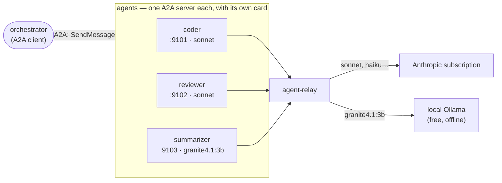

# Multi-agent with A2A: a worked example

A runnable three-agent system — a **coder**, a **reviewer**, a **summariser** —
orchestrated over A2A, all thinking through **one relay**.

Code: [`docs/examples/multiagent/`](https://github.com/s-celles/agent-relay/tree/main/docs/examples/multiagent)
(`agents.py`, `orchestrator.py`).

## One relay, several agents

The instinct to run several relays — one per agent — is the wrong one, and it is
worth saying why.

A multi-agent system is interesting because its agents differ by **role**: a
coder, a reviewer, a summariser. They do *not* become interesting by differing in
which model they run on. Several relays would give you several agents with the
same role and different brains — the least useful axis to vary.

So the specialisation belongs in the **agents**, and the relay stays what it is:
the thing that thinks, underneath all of them.



An agent's whole identity here is **a system prompt plus a model**. That is the
point: specialisation is cheap, and it is where the value of a multi-agent system
actually lives.

Several *relays* do have legitimate uses — but they are about **deployment**, not
composition: a relay with agentic execution enabled and one without are two
different privilege boundaries, and that separation is a process-level thing.

## What the relay buys you: a brain per agent, priced per job

Each agent picks its model from the same relay, with the same token. The coder
and the reviewer are worth the subscription. The summariser is not — it runs on a
**local Ollama model**: free, offline, no data leaves the machine.

The relay's own cost accounting shows it, from the run below:

| agent | model | cost |
|---|---|---|
| coder | `sonnet` | $0.197 |
| reviewer | `sonnet` | $0.071 |
| **summariser** | **`granite4.1:3b`** (local) | **$0** |

One line of config apart. That is a real orchestration decision — spend where it
matters — and it is the relay that makes it a one-word change.

## The agents are real A2A servers

Each agent publishes its own **Agent Card** and serves the JSON-RPC binding. The
orchestrator never imports them: it is handed three base URLs, reads the cards to
learn what each agent *is*, and delegates over the protocol — exactly as it would
to an agent someone else wrote, on another machine, in another language.

That is what makes this A2A rather than three function calls in a trench coat.

## Running it

Start a relay with the Ollama route (the summariser needs it):

```sh
just run-hybrid
```

Install the example's dependencies:

```sh
python3 -m venv .venv
.venv/bin/pip install 'a2a-sdk[http-server]' anthropic uvicorn
```

Start the three agents, each in its own terminal (or with `&`):

```sh
export RELAY_URL=http://127.0.0.1:18082
export RELAY_TOKEN=$(just print-token)

.venv/bin/python docs/examples/multiagent/agents.py coder       # :9101
.venv/bin/python docs/examples/multiagent/agents.py reviewer    # :9102
.venv/bin/python docs/examples/multiagent/agents.py summarizer  # :9103
```

Then orchestrate:

```sh
RELAY_TOKEN=$(just print-token) \
  .venv/bin/python docs/examples/multiagent/orchestrator.py \
  "a function that checks whether a string is a palindrome"
```

## What it does

```
Discovering agents…
  coder agent        write-code     Writes a small, self-contained piece of code to a spec.
  reviewer agent     review-code    Reviews code and reports concrete defects.
  summarizer agent   summarize      Condenses a result into one sentence.

[1] coder      ← 'a function that checks whether a string is a palindrome'
      def is_palindrome(s: str) -> bool:
          """Check whether a string is a palindrome. …"""

[2] reviewer   ← the code above
      - Correctness: logic is sound for the documented behavior …
      - Uses `.lower()` rather than `.casefold()`, so it won't correctly match
        case-insensitive equivalence for special characters like German `ß` …

[3] summarizer ← both (local model — free)
      The function correctly implements a case-, space-, and punctuation-insensitive
      palindrome check with appropriate documentation.
```

The reviewer earns its keep — `.lower()` vs `.casefold()` on `ß` is a real defect,
not a platitude. And the summariser cost nothing.

## Where to go next

- **Give an agent tools.** These three only talk. An agent that *acts* sends
  `tools[]` and runs the [client-tool loop](api.md#client-defined-tools) — the
  relay serves it on both wires.
- **Let an agent run code on the host.** Present the agentic credential and the
  relay executes in a workspace, returning the files as artifacts. That is what
  the relay's [own A2A adapter](a2a.md) exposes — useful when *your relay* is the
  peer in someone else's network, which is a different job from the one on this
  page.
- **Route by difficulty, not by hand.** Here the model choice is fixed per agent.
  A triage agent (local, free) could decide which brain each task deserves.

!!! note "This is an example, not a framework"

    The relay is not an agent framework, and this page does not make it one. If
    you want persistence, retries, planning and human-in-the-loop, reach for a
    real orchestration framework (Google ADK has first-class A2A support,
    LangGraph and CrewAI are options) and point its agents at the relay exactly
    as these three do.
